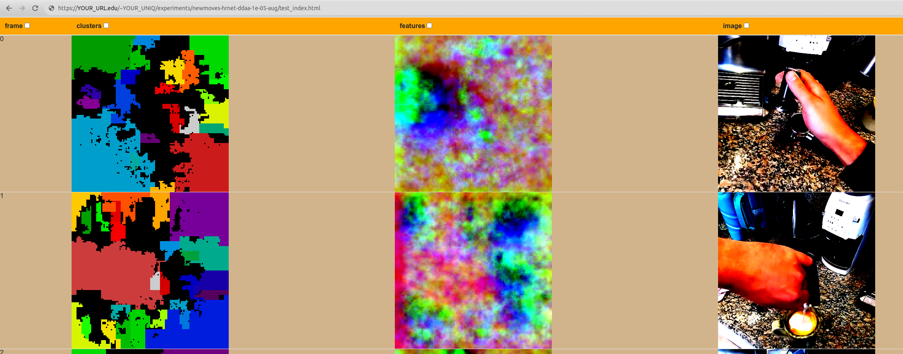

# MOVES: Manipulated Objects in Video Enable Segmentation
====================================

MOVES is a self-supervised means of learning visual features useful for segmentation
from arbitrary collections of video. At inference time, MOVES requires only an image
to produce visual features and a segmentation mask. 

Additionally, we demonstrate how one can use pseudolabel segmentation masks as a means
of discriminating between people and the objects they use. One could also use robot 
segmentation masks to similarly apply this addition to robotic manipulation video.

## Installation

Your mileage will vary, but something like this on a GPU machine should work. Use conda if you haven't switched to mamba:
 
```
mamba install pytorch torchvision torchaudio pytorch-cuda=11.8 -c pytorch -c nvidia
mamba install -c rapidsai -c conda-forge -c nvidia \
              rapids=23.10 cuml=23.10 python=3.10 cuda-version=11.8
pip install -U openmim
mim install mmcv
pip install -r requirements.txt
mim download mmflow --config raft_8x2_100k_flyingthings3d_sintel_368x768
```

Note in the above you will have to separetly install PyTorch, RapidsAI, and MMFLOW. The last line downloads an optical flow model.

## Usage
As an example, lets try an arbitrary dataset, how about [UCF101](https://www.crcv.ucf.edu/data/UCF101.php). 

1. Visit the webpage and download the UCF101.rar
2. Run `unrar e UCF101.rar`. 
3. Put the videos in a folder, like `UCF101/`
4. Run `python pseudolabeller.py --video_path=./UCF101/`, this will:
- extract frames
- detect people in the frames using ternaus  
- cache forward and backwards optical flow between subsequent frames
5. Run `CUDA_VISIBLE_DEVICES=0,1,2,3,4,5,6,7 python main.py --name ucf101demo --model hrnet --target ddaa --people --port 23232 --train --inference`
6. Inside the experiments folder will be your experiment, it will have a `index.html` and `test_index.html` file with saved outputs. We use apache so we make a symlink to public html to view results.

```
mkdir UCF101/
cd UCF101/
wget https://www.crcv.ucf.edu/data/UCF101/UCF101.rar
unrar e UCF101.rar
cd ..
python pseudolabeller.py --video_path=./UCF101/
CUDA_VISIBLE_DEVICES=0,1,2,3,4,5,6,7 python main.py --name ucf101demo --model hrnet \
                     --target ddaa --people --port 23232 --train --inference
```

## Visualization

If everything has worked, you should see results pages that look like this:

<p align="center">
  
</p>


And then this for inference, where the HDBSCAN segments (labelled as clusters) are the output.

<p align="center">
  
</p>

## Citation
-----------------

If you find our method or this repo helpful, please consider citing our conference paper:

```bibtex
@inproceedings{higgins2023moves,
  title={MOVES: Manipulated Objects in Video Enable Segmentation},
  author={Higgins, Richard EL and Fouhey, David F},
  booktitle={Proceedings of the IEEE/CVF Conference on Computer Vision and Pattern Recognition},
  pages={6334--6343},
  year={2023}
}
```

